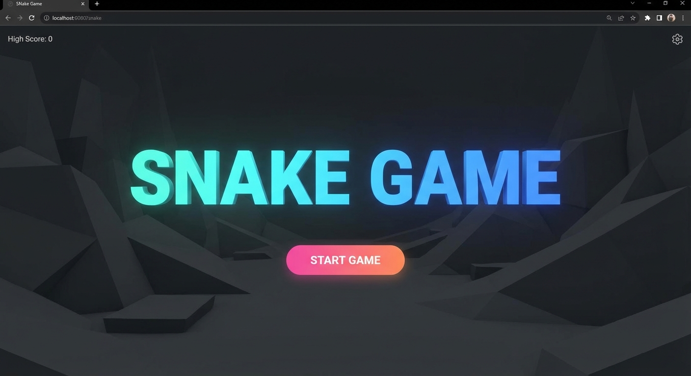
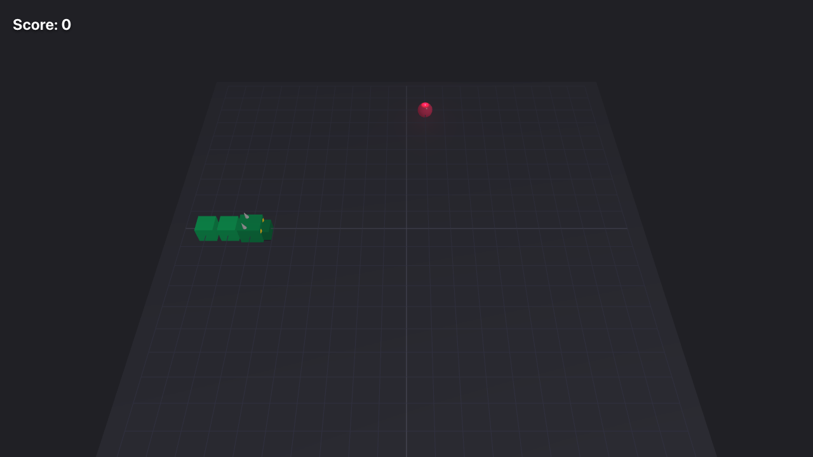

# 🐍 3D Snake Game

A modern, colorful 3D Snake Game built with **Three.js** and **Vanilla JavaScript**.

Features include:
- 🐉 **Dragon Head**: A custom-built 3D dragon head for the snake.
- 🍎 **Normal Food**: Respawns immediately when eaten.
- 💛 **Special Food**: A giant golden heart that spawns randomly, grants double points, and has a **5-second timer**!
- 🔊 **Sound Effects**: Synthesized sound effects for eating food.
- 🧱 **Continuous Walls**: The snake wraps around the grid boundaries.
- 🎥 **Camera Controls**: Rotate and zoom the camera with your mouse.

## 🚀 Quick Start

Follow these instructions to get the project running locally on your machine.

### Prerequisites

- **Node.js** (v14 or higher recommended)
- **npm** (usually comes with Node.js)

### Installation

1.  **Clone the repository:**
    ```bash
    git clone https://github.com/sonttran/snakegame-by-ai.git
    cd snakegame-by-ai
    ```

2.  **Install dependencies:**
    ```bash
    npm install
    ```

3.  **Start the development server:**
    ```bash
    npm run dev
    ```

4.  **Open your browser:**
    Navigate to the URL shown in the terminal (usually `http://localhost:5173` or `http://localhost:5174`).

## 🎮 Controls

- **Arrow Keys**: Move the snake (Up, Down, Left, Right).
- **Mouse Left Click + Drag**: Rotate the camera.
- **Mouse Scroll**: Zoom in/out.

## 📸 Screenshots

### Start Screen


### Gameplay


## 🧪 Running Tests

This project uses **Vitest** for unit testing.

```bash
npm run test
```

## 🛠️ Built With

- [Vite](https://vitejs.dev/) - Next Generation Frontend Tooling
- [Three.js](https://threejs.org/) - JavaScript 3D Library
- [Vitest](https://vitest.dev/) - Blazing Fast Unit Test Framework

---
*Generated by Antigravity AI*
